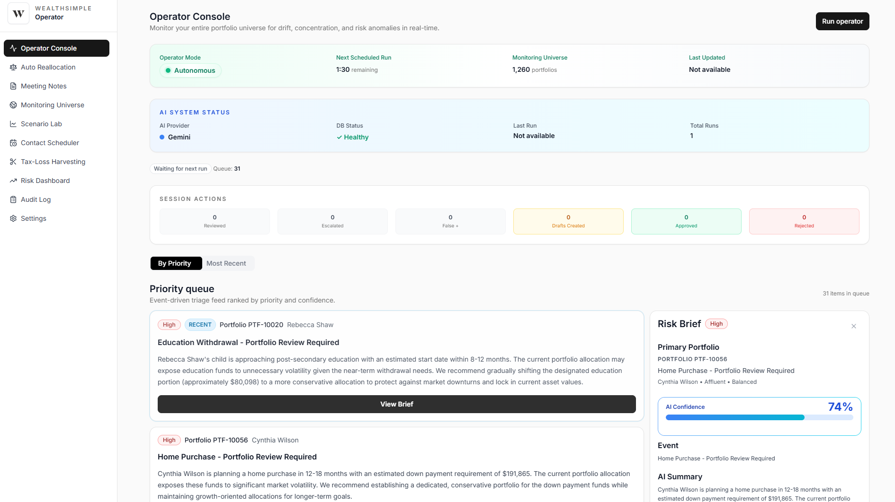
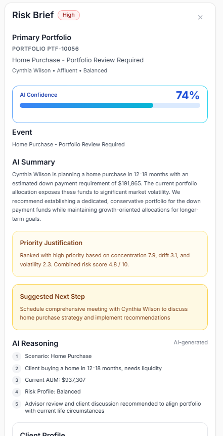
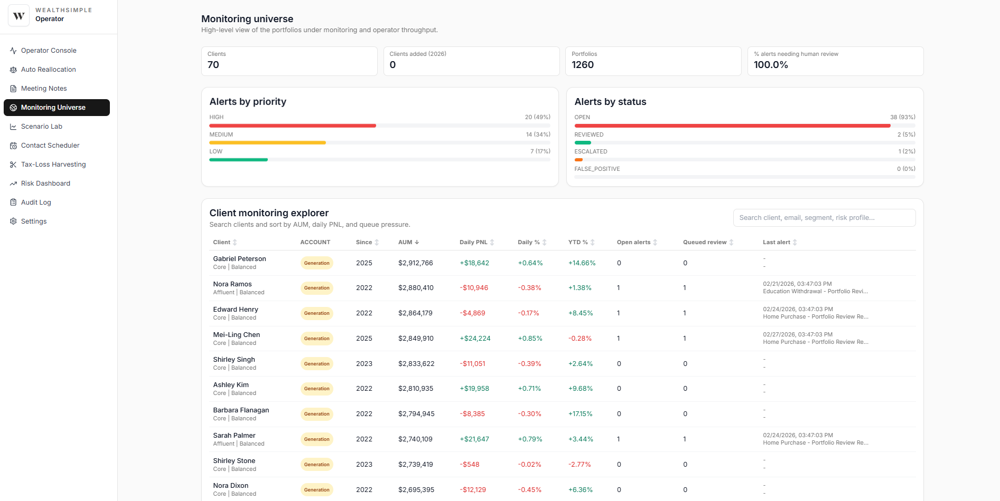
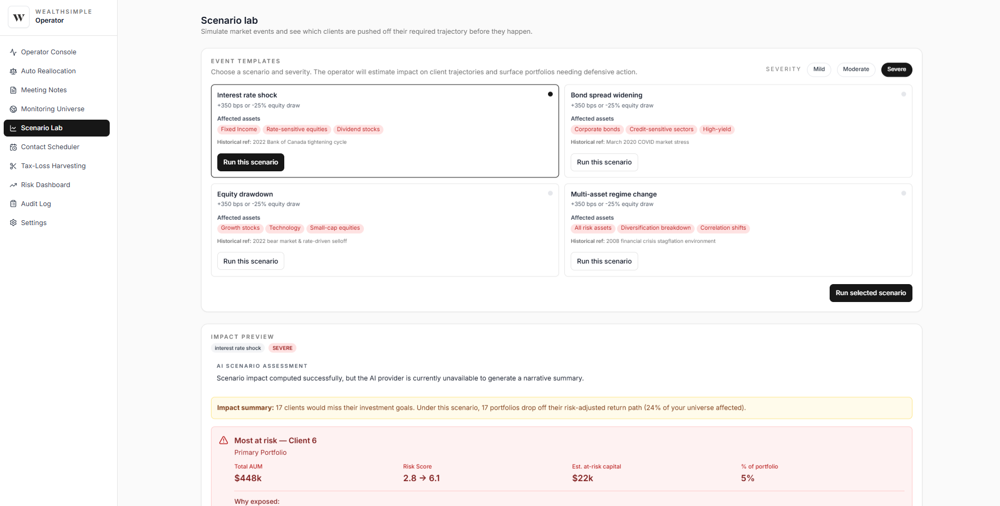
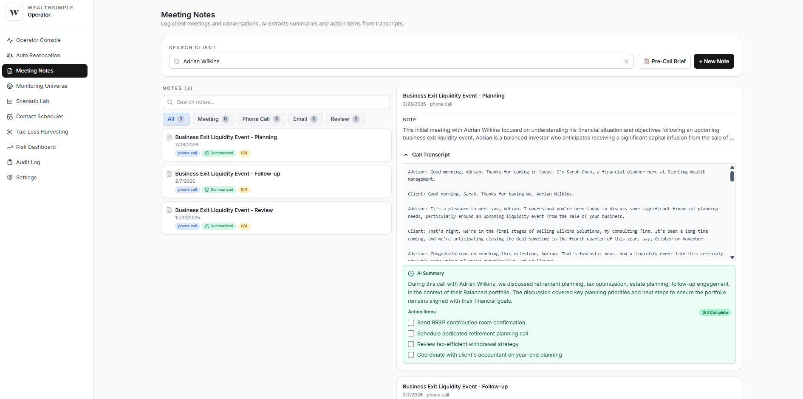

# Wealthsimple Operator

AI-assisted portfolio operations console built to explore how AI can help advisors monitor portfolios, triage alerts, and document decisions more efficiently.

This project was created for the **Wealthsimple AI Builders Challenge at the University of Waterloo**. The goal was to prototype how modern AI tooling could be integrated into **existing portfolio operations workflows** — not to replace advisors, but to **reduce manual monitoring and surface the most important signals faster**.

In many financial workflows today, advisors still spend significant time switching between dashboards, reviewing alerts, and manually documenting actions. This project explores what an **AI-native operations console** could look like if those workflows were redesigned with AI in mind.

Instead of scanning multiple systems, advisors interact with a **single console that prioritizes alerts, summarizes context, and records decisions in one place**.

---

# What This Project Demonstrates

This demo explores how AI could be used inside internal portfolio tools to:

- Continuously monitor portfolios for potential risk signals  
- Prioritize alerts so advisors can focus on the most important items  
- Provide structured context explaining why alerts were generated  
- Reduce manual dashboard monitoring across multiple systems  
- Maintain a clear audit trail of advisor decisions  

The system focuses on **decision support**, not automated trading.  
AI organizes information and surfaces insights, while **humans remain responsible for final portfolio decisions**.

---

# Screenshots

### Operator Overview


The main console where advisors can run portfolio scans and review prioritized alerts generated by the system.

---

### Alert Detail


Alerts include structured reasoning and context so advisors can quickly understand why a signal was triggered.

---

### Monitoring Universe


A high-level view of monitored portfolios and signals detected across the system.

---

### Scenario Lab


A space for exploring hypothetical portfolio scenarios and understanding potential outcomes.

---

### Meeting Notes


A simple workflow for documenting advisor decisions and client conversations with a structured audit trail.

---

# Technology

### Backend

- Python  
- FastAPI  
- SQLAlchemy  
- SQLite  

### Frontend

- Next.js (App Router)  
- React  
- TypeScript  
- Tailwind CSS  

### AI Integration

- Mock provider for deterministic demos  
- Optional Gemini integration for AI-generated reasoning

---

# Repository Structure

```
wealthsimple-operator/
│
├─ backend/
│  ├─ ai/
│  ├─ routes/
│  ├─ main.py
│  ├─ operator_engine.py
│  ├─ seed.py
│  └─ requirements.txt
│
├─ frontend/
│  ├─ app/
│  ├─ components/
│  ├─ lib/
│  └─ package.json
│
├─ data/
│  └─ seed_output.json
│
├─ docs/
│  └─ images/
│
└─ README.md
```

---

# Notes

This project is a **demo prototype created for the Wealthsimple AI Builders Challenge**.

It is intended to explore how AI can support internal portfolio operations workflows such as monitoring, alert triage, and documentation.

It is **not intended for live trading, investment advice, or production financial systems**.